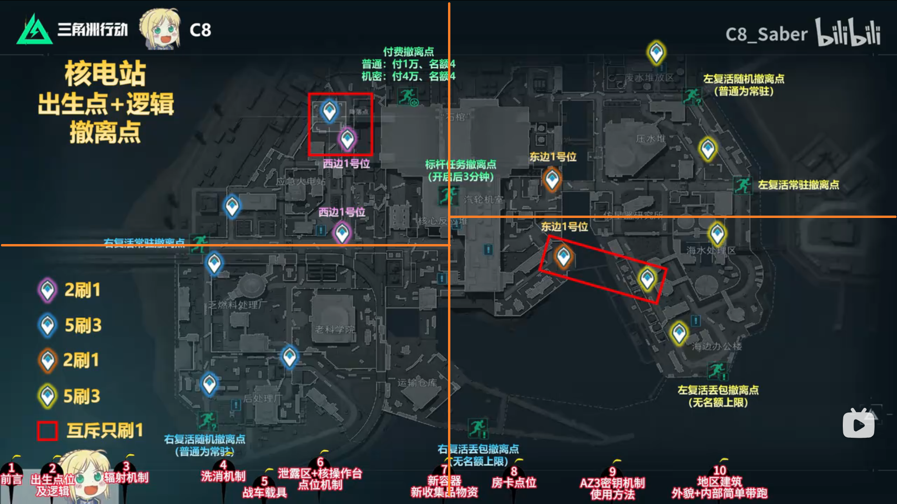
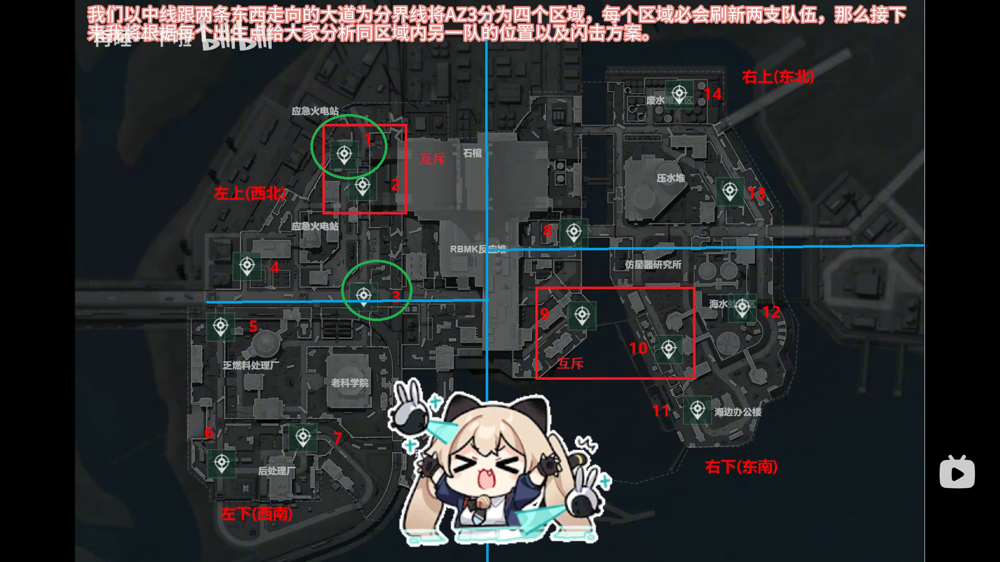

# AZ3核電站

## 基礎觀念(左右各`四`隊人，`8`種撤離方式)
* 大地圖說明

    

* 出生點說明劃分

    

### 西邊分析
#### `2 & 3 為西邊一號位`
* 1號位出生: `1 / 2 互斥，所以另一隊在3號`

    

* 2號位出生: `1 / 2 互斥，所以另一隊在4號`

    

* 3號位出生: 無法判斷另一隊是在 1 or 4，建議可以先往老科學院(資源多)再往核心區
* 4號位出生: `2 / 3 一定有一隊`，建議往火電站

* 6、7號位出生: `西南區沒有必刷位置隨機三選二`，6&7出生的話建議先對方地點探查

### 東邊分析
#### `8 & 9 為西邊一號位`
* 8號位出生: `只差另一隊資訊，先去壓水堆看 13 or 14`
* 9號位出生: `上半區 13 & 14 必刷`，可上壓水堆探或是去仿星器研究所蹲人
* 10號位出生: `直接先探11號(11號出生位置不佳)`沒人就跟9號位打法一樣
* 11號位出生: `先燒香祈求沒有人來閃擊`，頂多往海水處理廠(12號)打比較有機會
* 12號位出生: `先往10 or 11 方向探有優勢`
* 13 & 14號位出生: `先往壓水堆打`後續再看情況動作

### 撤離點說明
#### 拉閘撤離
##### 標竿任務
* 開啟後` 3分鐘 `

#### 付費撤離
* `普通`:付費1W，名額4
* `機密`:付費4W，名額4

     

#### 丟包撤離
* 撤離條件: ` 不能攜帶背包 `
* 注意事項: 

    

### 參考資料
-  [【三角洲S10】核电站最详细攻略🔥出生点及规律/辐射机制/洗消机制/洗消车载具机制/泄露区/核设施操作台/新容器/房卡/新收集品大红/AZ3密钥/实机演示 by C8_Saber](https://www.bilibili.com/video/BV1h2Eq63E1a/?spm_id_from=333.337.search-card.all.click&vd_source=3e6241ea6065bcf4f9a52bba4006255b)
-  [【AZ3核电站出生点位分析及开局闪击思路-by 再睡一下啦](https://www.bilibili.com/video/BV1iRTr6wEfm/?spm_id_from=333.337.search-card.all.click&vd_source=3e6241ea6065bcf4f9a52bba4006255b)

## 💡 實戰心得
### 實況主心得

### 個人心得
- N/A

---
## 🔗 相關連結
- [⬅️ 返回三角洲首頁](../delta-force.md)

