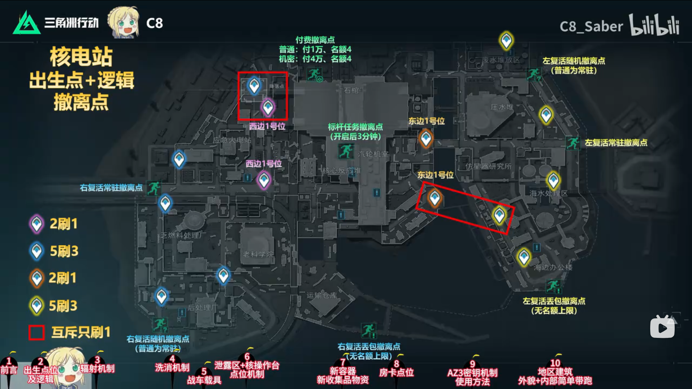
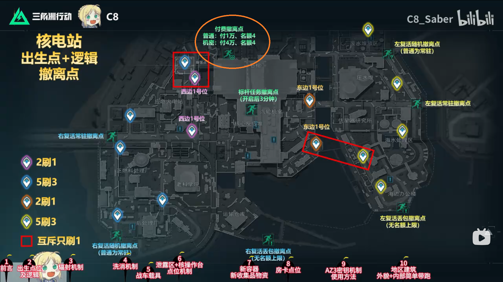
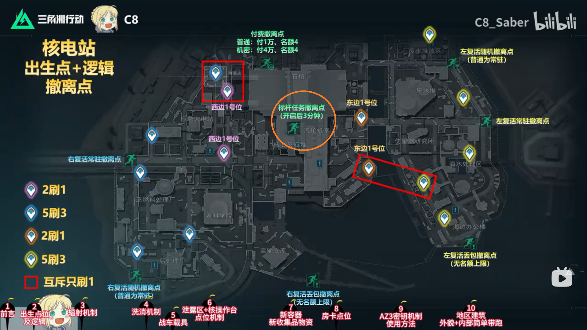

# AZ3核電站

## 基礎觀念(左右各`四`隊人，`8`種撤離方式)
* 大地圖說明

    

### 撤離點說明
#### 拉閘撤離
##### 標竿任務
* 開啟後` 3分鐘 `

#### 付費撤離
* `普通`:付費1W，名額4
* `機密`:付費4W，名額4

     

#### 丟包撤離
* 撤離條件: ` 不能攜帶背包 `
* 注意事項: 

    

### 參考資料
-  [【三角洲S10】核电站最详细攻略🔥出生点及规律/辐射机制/洗消机制/洗消车载具机制/泄露区/核设施操作台/新容器/房卡/新收集品大红/AZ3密钥/实机演示 by C8_Saber](https://www.bilibili.com/video/BV1h2Eq63E1a/?spm_id_from=333.337.search-card.all.click&vd_source=3e6241ea6065bcf4f9a52bba4006255b)

## 💡 實戰心得
### 實況主心得

### 個人心得
- N/A

---
## 🔗 相關連結
- [⬅️ 返回三角洲首頁](../delta-force.md)

