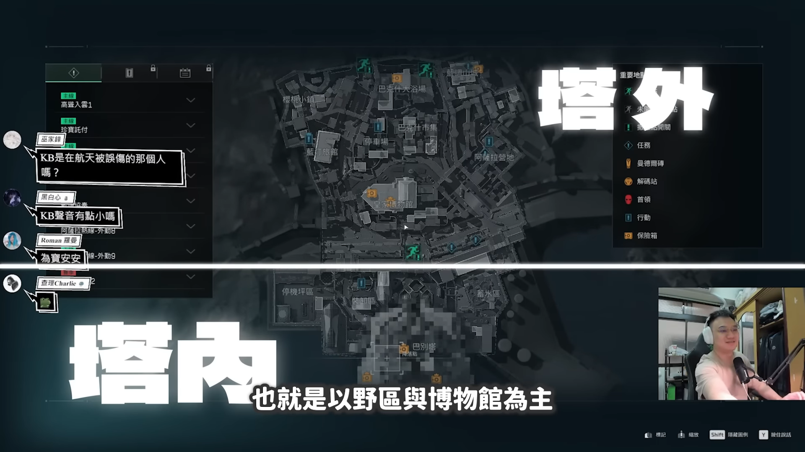
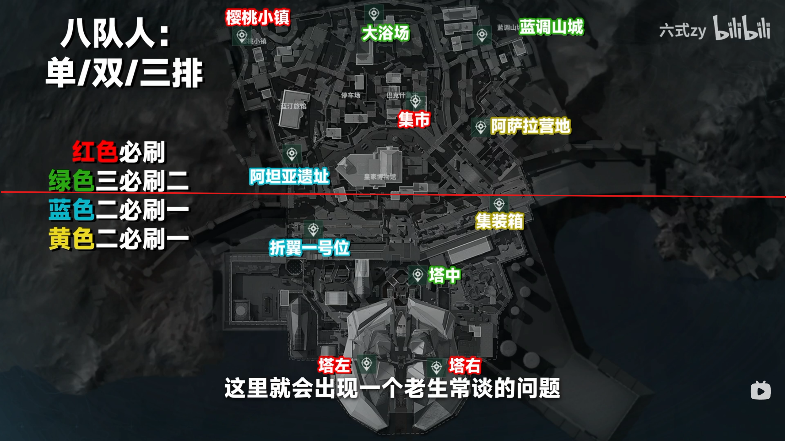
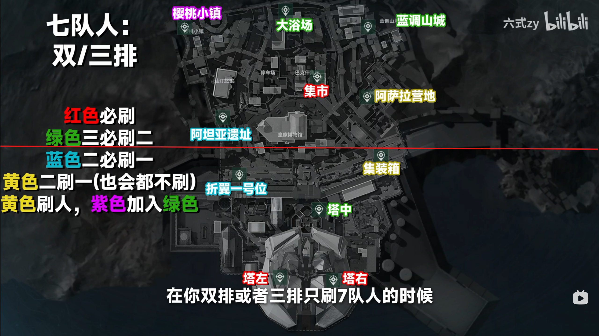
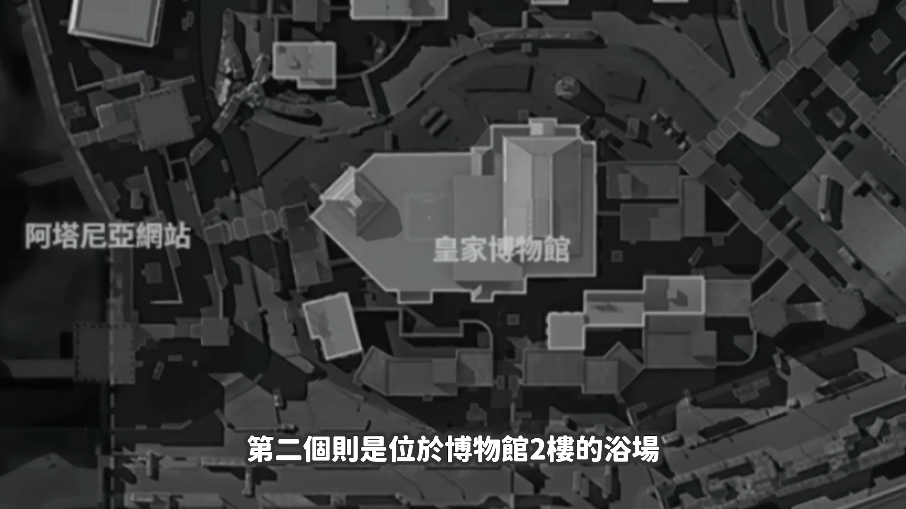
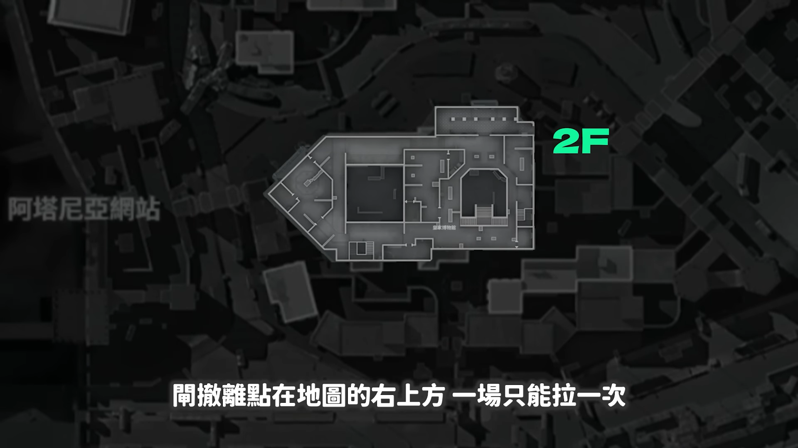
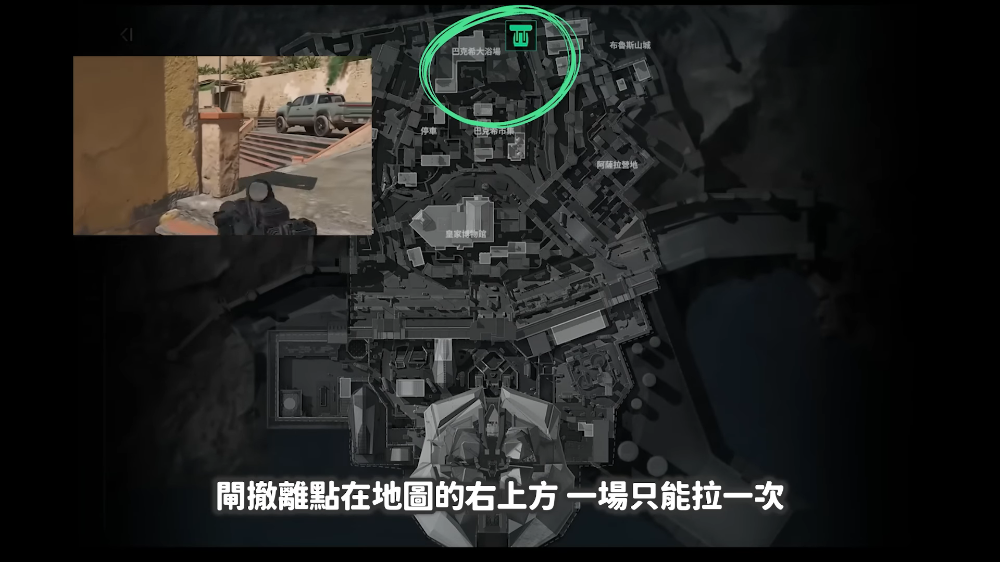
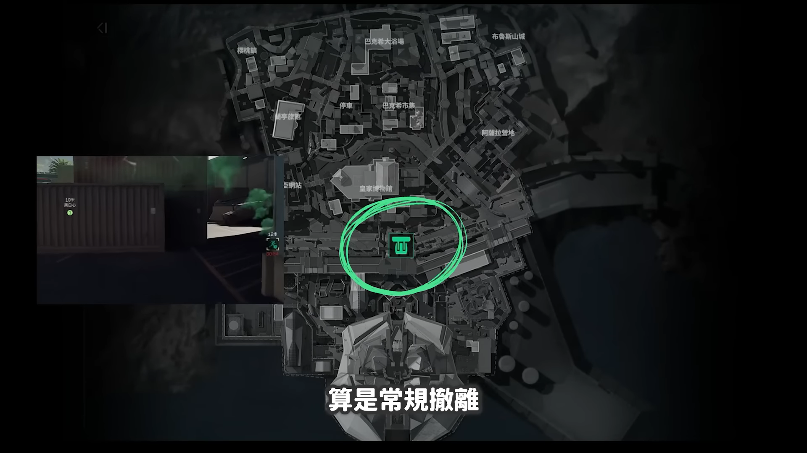
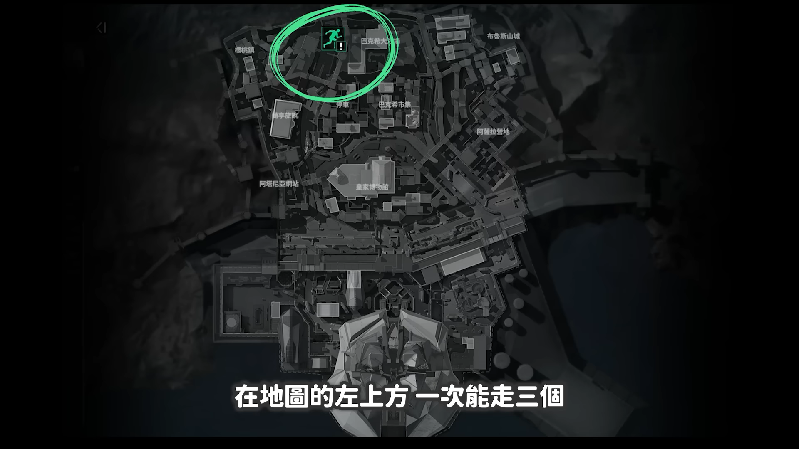
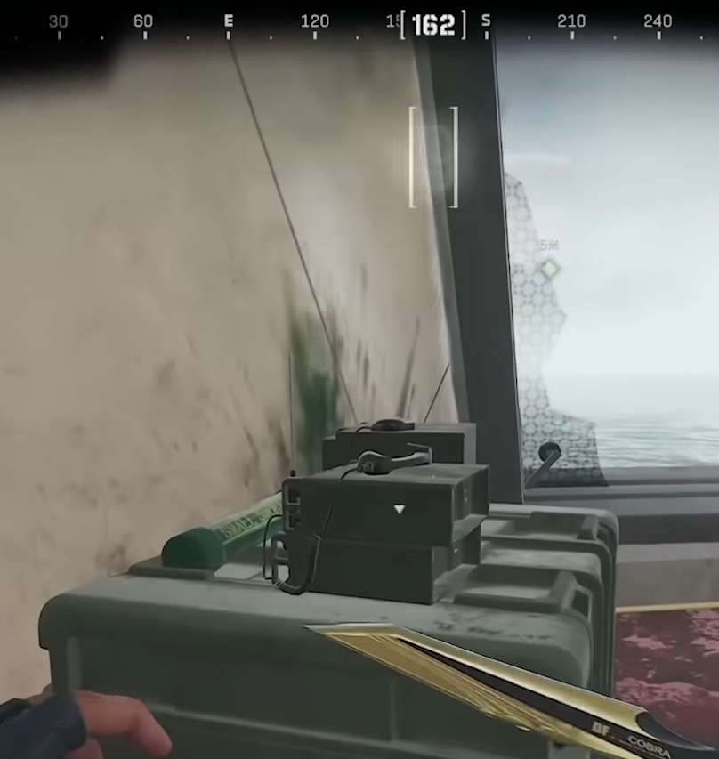

# 巴克什

## 基礎觀念(通常7~8隊，總計19~23人，5種撤離方式)
* 以打法分` 分塔內、塔外` 
    * 塔內
        * ` 巴別塔左 (海洋區) ` 
        * ` 塔中 ` 
        * ` 巴別塔右 (醫療區) ` 
        * ` 折翼一號位` 
        * ` 集裝箱一號位 ` 

    * 塔外
        * ` 阿坦雅遺址 ` 
        * ` 阿薩拉營地 ` 
        * ` 巴克什集市 ` 
        * ` 櫻桃小鎮 ` 
        * ` 巴克什大浴場 ` 
        * ` 藍調山城 ` 

    
    
* ` 8隊人 ` 復活點整理
    * 塔內固定點位
        * ` 巴別塔左 (海洋區) ` 
        * ` 巴別塔右 (醫療區) ` 
    * 塔外固定點位
        * ` 巴克什集市 `
        * ` 櫻桃小鎮` 
    * 塔內外隨機點位
        * ` 折翼一號位 & 阿坦雅遺址 二刷一`
        * ` 阿薩拉營地 & 集裝箱一號位 二刷一`
        * ` 塔中 & 巴克什大浴場 & 藍調山城 三刷二`

    

* ` 7隊人 ` 復活點整理
    * 塔內固定點位
        * ` 巴別塔左 (海洋區) ` 
        * ` 巴別塔右 (醫療區) ` 
    * 塔外固定點位
        * ` 巴克什集市 `
    * 塔內外隨機點位
        * ` 折翼一號位 & 阿坦雅遺址 二刷一`
        * ` 阿薩拉營地 & 集裝箱一號位 二刷一`
        * ` 塔中 & 巴克什大浴場 & 藍調山城 & 櫻桃小鎮 四刷二`

    

### 核心區域說明
#### 如何進入核心區域?
* 

### 撤離點說明
#### 拉閘撤離
##### 浴場閘
* 須開啟` 博物館二樓右上方 `閘點才可以開啟撤離點
* ` 一場只能拉一次` 
    

    

    

##### 巴別塔前撤離(常規撤離)
* 須開啟` 博物館地下室 or 巴別塔一樓 `閘點才可以開啟撤離點

    

#### 丟包撤離
* 撤離條件: ` 不能攜帶背包 `
* 注意事項: 
    * 撤離名額: ` 機密名額 3 名 `，` 絕密 1 名 `。
    * 可以撤離時間點: ` 21 分鐘 `左右開啟
    * 撤離等待時間: ` 10 秒 `

    

#### 飛鼠撤離
* 啟動條件: ` 提交兩個軍牌即可 `

    

### 參考資料
-  [【WuWei】《三角洲行動》台服玩家最不熟的神圖？表面複雜但其實打起來又賺又簡單？Delta Force之巴克什攻略！](https://www.youtube.com/watch?v=FdhqS2QFUmA)
-  [巴克什出生点刷人规则3.0版 如同透视般开局- 六式zy](https://www.bilibili.com/video/BV1R3xVzkEBM?spm_id_from=333.788.player.player_end_recommend_autoplay&vd_source=3e6241ea6065bcf4f9a52bba4006255b&trackid=web_related_0.router-related-2479604-tn27s.1785986827263.429)

## 💡 實戰心得
### 實況主心得

### 個人心得
- N/A

---
## 🔗 相關連結
- [⬅️ 返回三角洲首頁](../delta-force.md)

