# 航天基地-`打航天不管幾號位，都要戴狙擊槍`

## 基礎觀念(通常六隊，總計18人)
* `若有殘編隊會額外多刷一隊，人數大約16~18人`
* 宿舍 & 二員必刷

    

* 三刷二: 中控、西大、發射

    

* 三刷二: 牢大、牢二、牢三

    

* 小節

    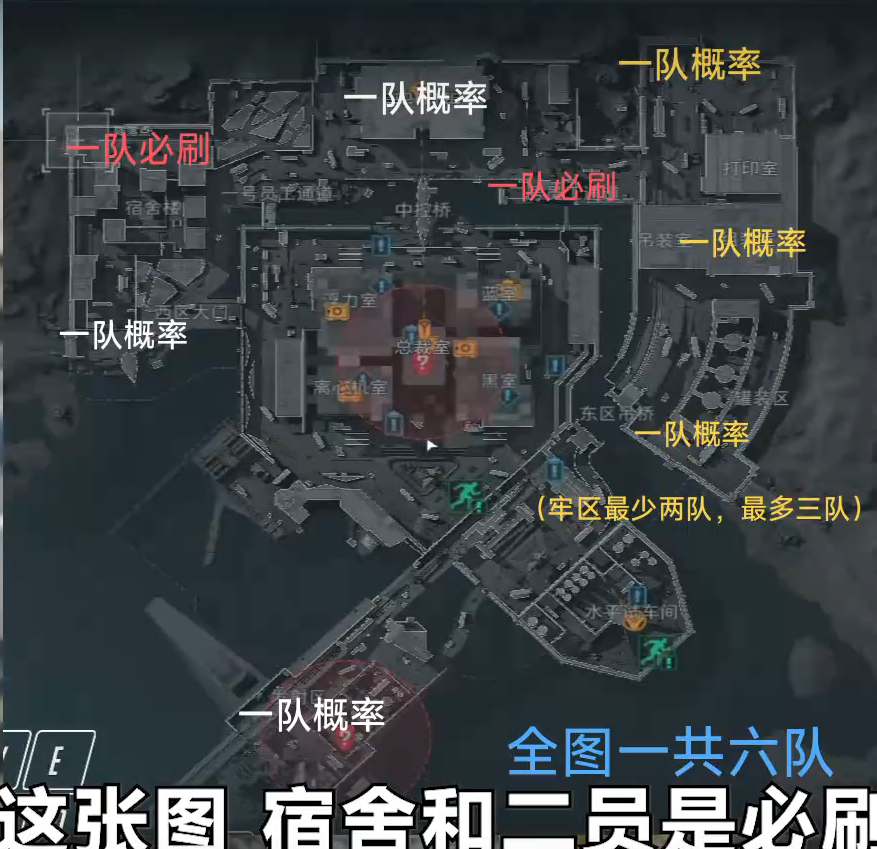

### 核心區域說明
#### 如何進入核心區域?
* 免費: 中控、飛升橋
* 付費: 
    * 1 / 2 號員工通道
    * 西大 / 東區吊橋

    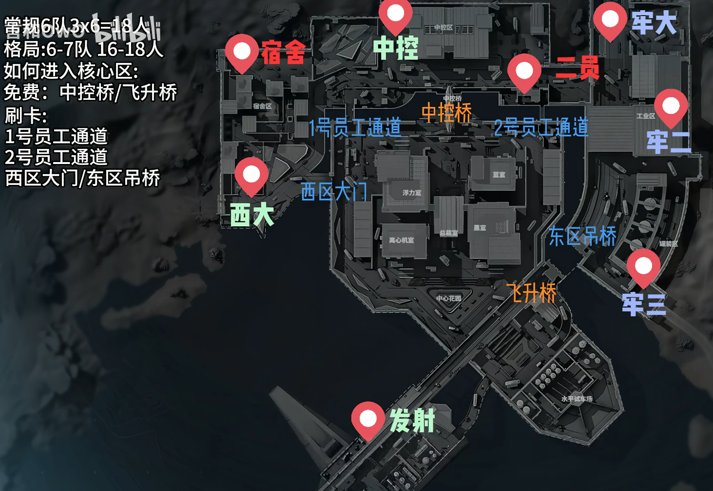

* 核心區域優先順序
    * 以`西大`為基準順時針說明，各點位搶核心區域

        | 起點  | 路徑 | 目標 | 備註 |
        | :---  | :--- | :--- | :--- |
        | 西大  | --> | 浮力 | |
        |      | --> | 離心 | |
        | 中控 | --> | 浮力 | |
        | 二員 | --> | 藍室 | |
        |      | --> | 黑室 | |
        |牢三  | --> | 黑室 | 1.5號位 |
    
    * `其餘出稱點位皆是二號位`
    
    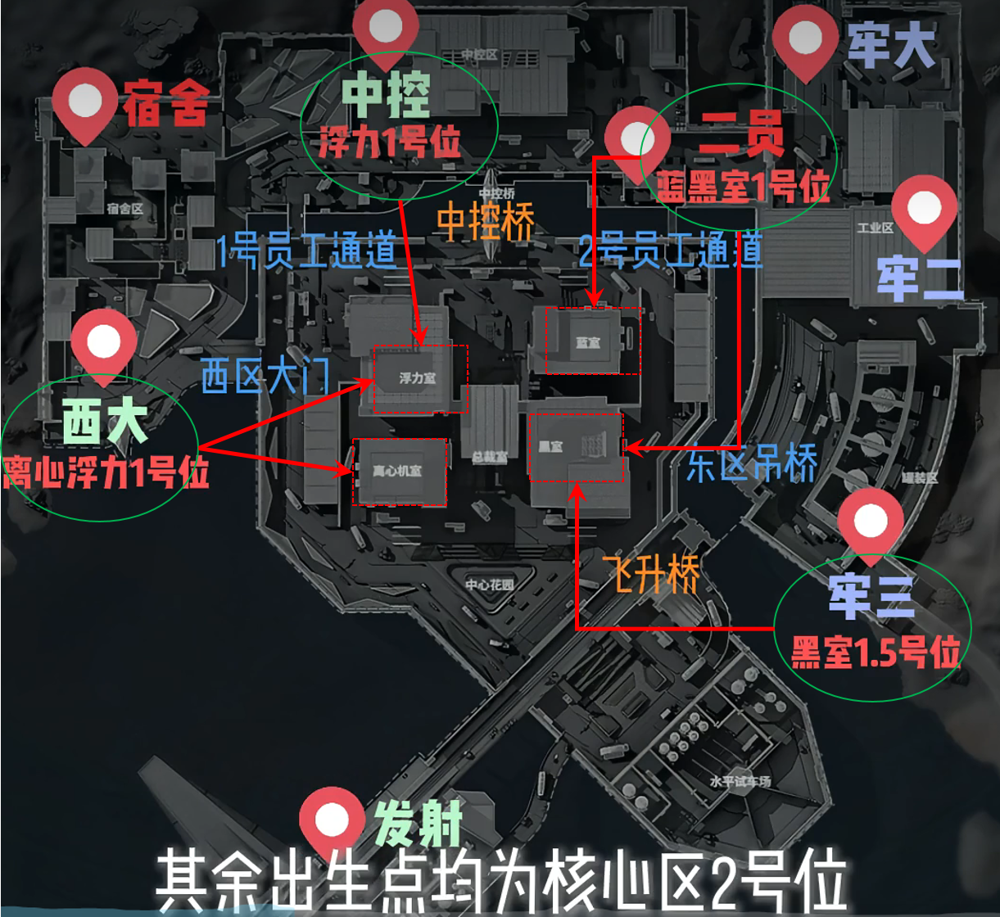

* 如何去總裁室?

    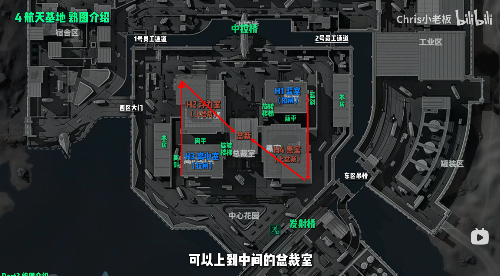

#### 區域特徵

* 藍室(H1): 主體區域是藍色，有藍色下沉平台內有` 拉閘點 `，閘點附近有大保險。

    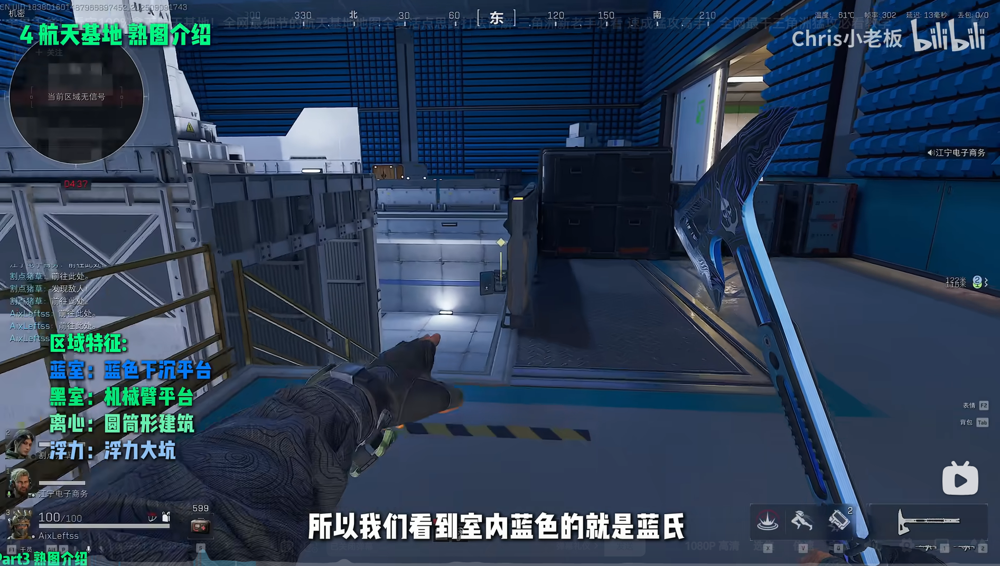

* 黑室(H4): 外部有冒黑煙，室內有巨大的機械臂和機械平台。
    * ` 只有小保險和航空箱 ` 

    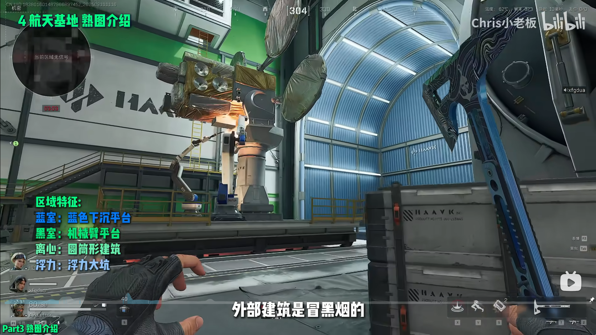

* 浮力-Buoyancy(H2): 浮力大坑。
    * `坑內有大、小保險和一個航空箱 ` 

    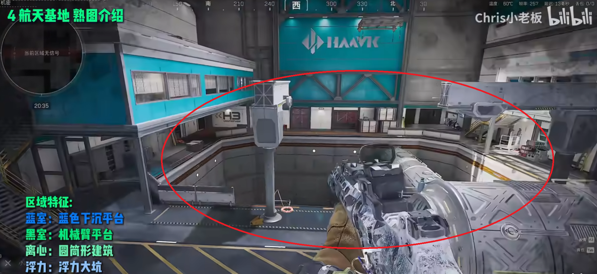

* 離心-Centrifuge(H3): 室內有巨大的圓筒結構。
    * 二樓有大保險，` 閘點在一樓 ` 

    

#### 細節說明
* ` 浮力 通 離心` ；` 藍室 通 黑室` 
* 藍室可以從` 二樓下到` 黑室，`但是`黑室只能從`一樓到`藍室
* 浮力和離心` 1 & 2 樓互通 `
* 搶點位時間說明
    | 起點   | 路徑 | 目標 | 時間 |
    | :---   | :--- | :--- | :--- |
    | 二員   | -->  | 黑室 | 40s|
    | 牢三   | -->  | 黑室 | 50s |
    | 發射區 | -->  | 黑室 | 60s，`有斷橋再加30s` |
    | 西大   | -->  | 離心 | 40s|
    | 發射區 | -->  | 離心 | 70s，`有斷橋再加30s` |
    | 西大   | -->  | 浮力 | 40s |
    | 中控   | -->  | 浮力 | 40s |
    | 宿舍   | -->  | 浮力 | 50s |

* 西大和中控搶離心都是40s左右，`但是中控開局會架二員且中控和核心區都會有狙擊兵，所以時間會更慢`

### 撤離點說明
#### 拉閘撤離
* 須開啟` 藍室 1F & 離心 1F `閘點才可以開啟撤離點
* 拉閘後` 計時 5 分鐘後可以撤離，無人數限制 `
* 閘點CD時間` 5 秒`，拉閘動畫` 4 秒 `
* ` 極限拉閘時間為 5 分 4 秒` ，通常是會抓` 5 分 10 秒 `拉閘
* ` 如果有人在 10 分 8 秒拉閘`就是最後一個閘點

    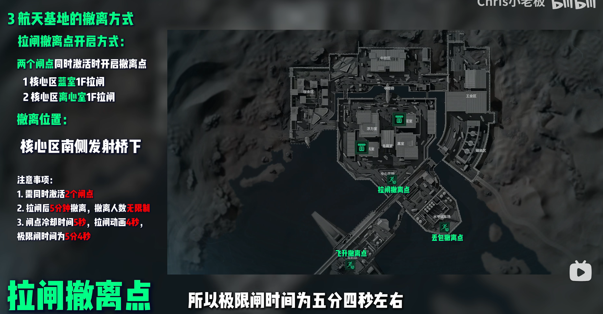

#### 丟包撤離
* 撤離條件: ` 不能攜帶背包 `
* 注意事項: 
    * 撤離名額: ` 機密名額 3 名 `，` 絕密 1 名 `。
    * 可以撤離時間點: ` 21 分鐘 `左右開啟
    * 撤離等待時間: ` 10 秒 `

#### 飛升撤離
* 啟動條件: ` 接取飛升撤離任務 `
* 隱藏條件:
    * ` 啟動 `電腦解碼 : 完成` 4 分半 `駐守任務後，` 1 分鐘 `撤離，時間共` 5 分 30 秒 `。
    * ` 不啟動 `電腦解碼 : 等待` 12 分後 `即時撤離。
* 注意事項: 
    * 可以撤離時間點: 遊戲時間剩餘` 15 分 30 秒 `。
    * 小技巧: 時間緊迫可以` 一個人接任務一個人按電腦` 。
    * ` 極限撤離為按下電腦後需要 5 分 30 秒` 

## 各點位教學
### 西大
#### 打法1
* 西大 -(開卡)-> 浮力 --> 離心 -->總裁

* `西大-->核心`開卡，`防宿舍偷`煙位，或是`反架宿舍`

    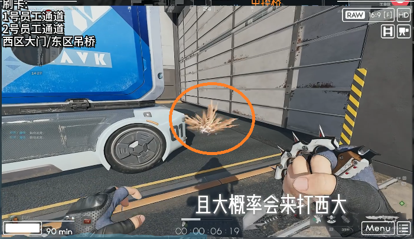

* `西大-->核心`開卡，水房`反架宿舍`

    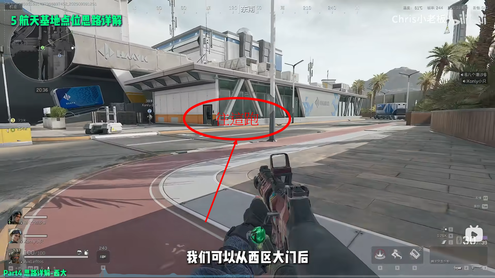

    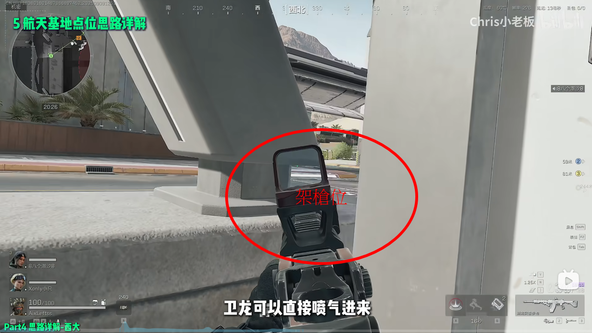

#### 打法2
* 西大 --> 宿舍

* `西大-->宿舍`架槍位

    

* 打宿舍上二樓的時間差

    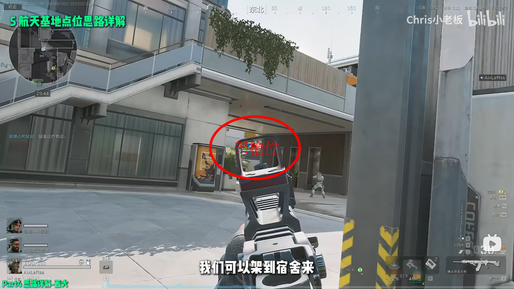

* 二樓架槍宿舍點位

    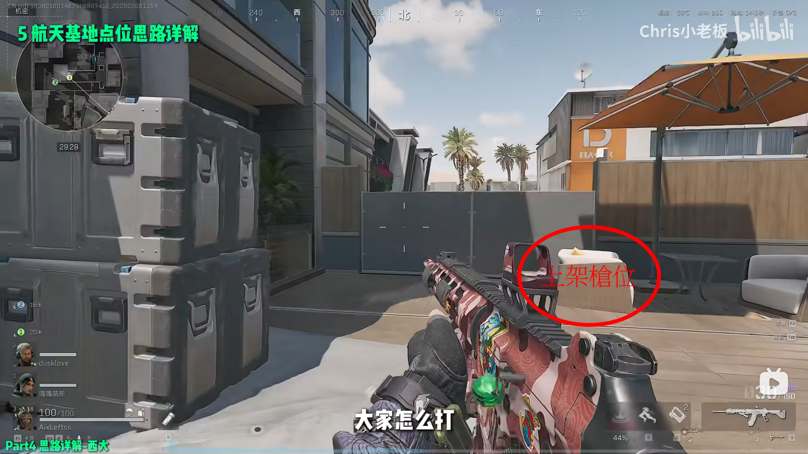

    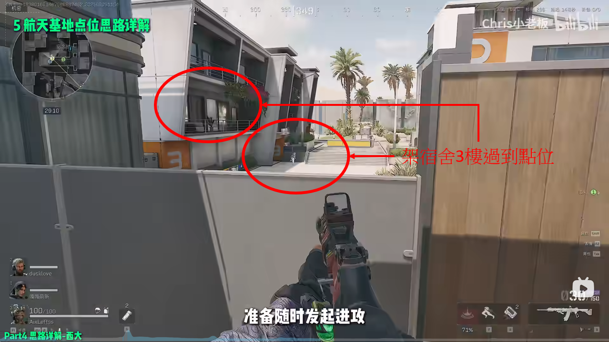

##### 備註
* 打完須注意`中控 & 核心`區域資訊

#### 打法3
* `西大躲在橋底約 1 分鐘`，然後偷襲宿舍或是尾隨撿漏

### 宿舍
* `宿舍開局一定要搶二樓平台，沒有選擇`
* `宿舍-->西大`搶架槍位

    

* 二樓架點1(`最推薦`)

    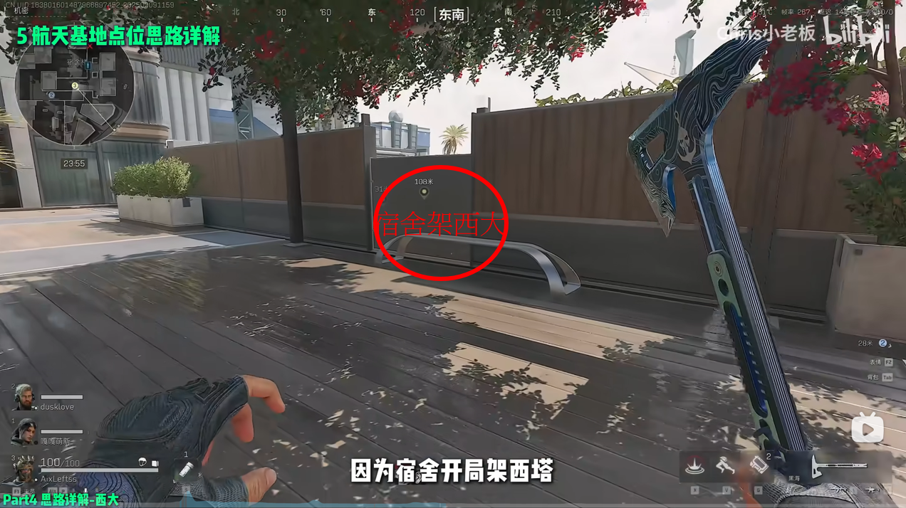

    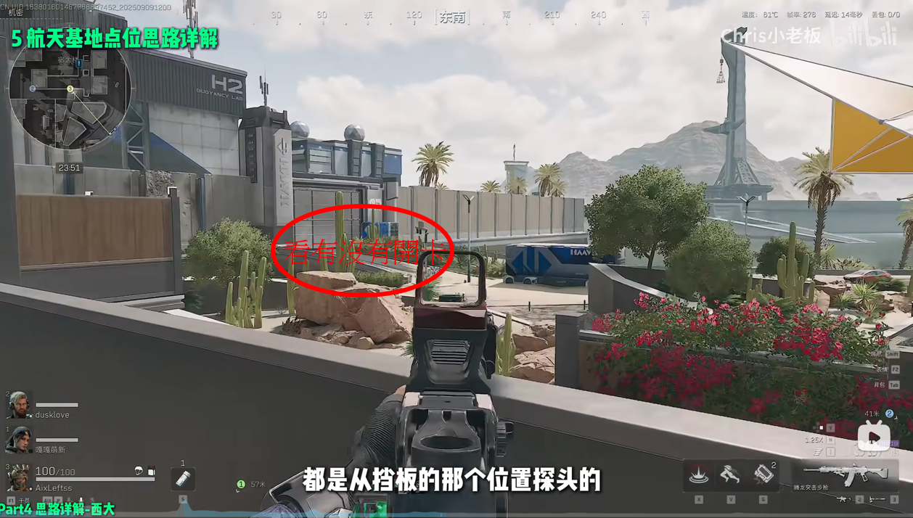

* 二樓架點2(`次推薦，但漏身位較大`)

    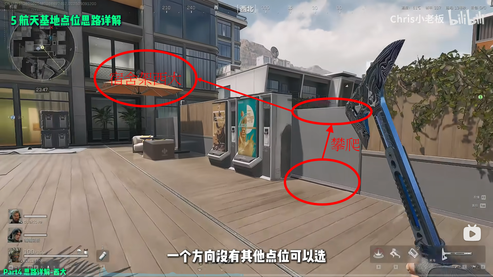

    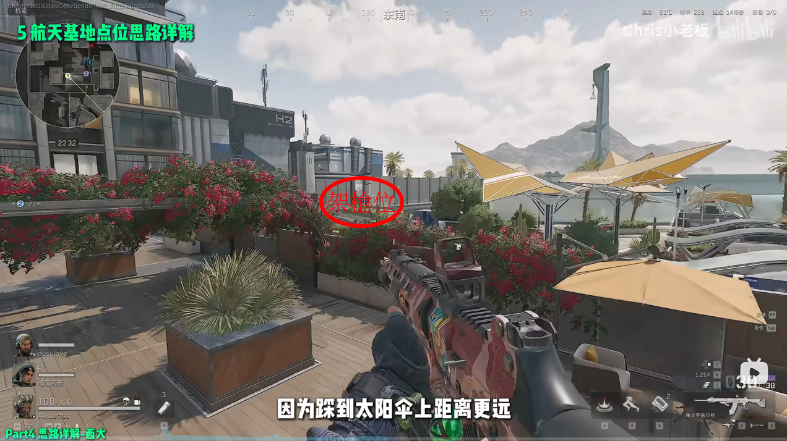

### 中控
* 當中控打架時`二樓陽台&中控橋一定要採住`
* `一定先看二員資訊`，有三種方式

#### 架槍位1
* 中控外側走到要道中控橋位置

    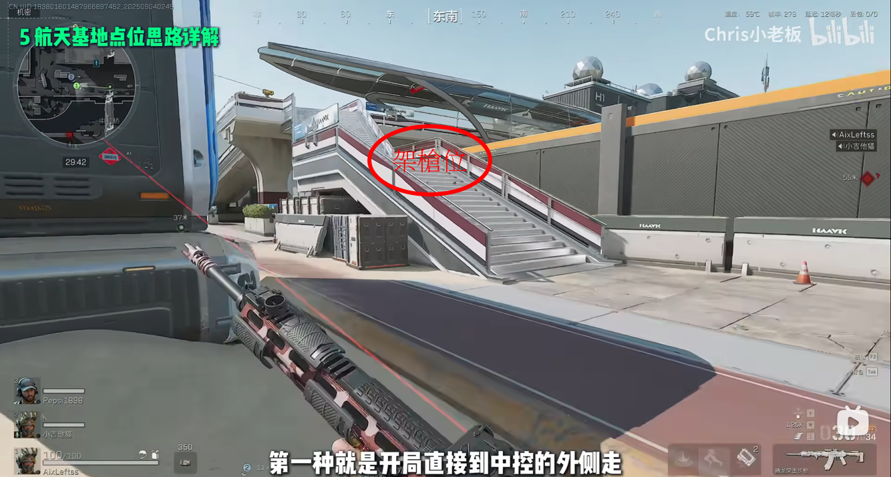

* 注意中控的狙擊AI

    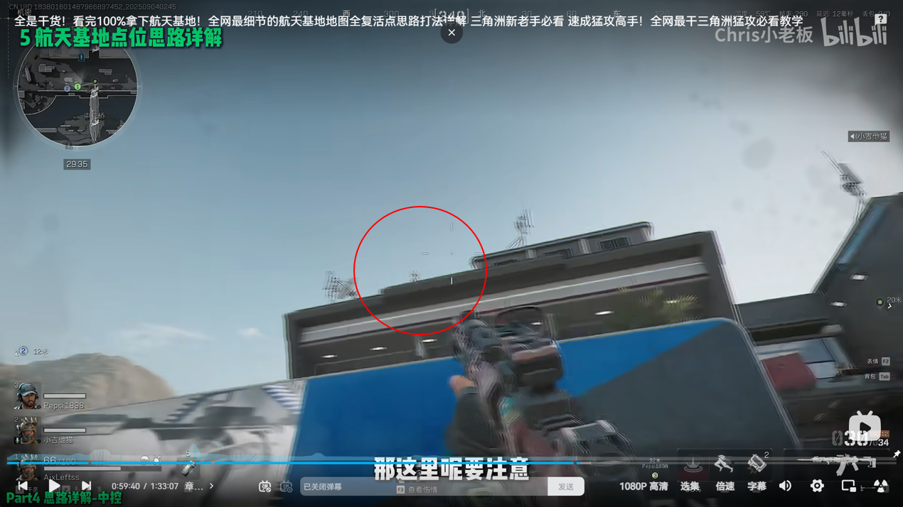

* 抽二員通道/或是從中控橋底下的繩索過點

    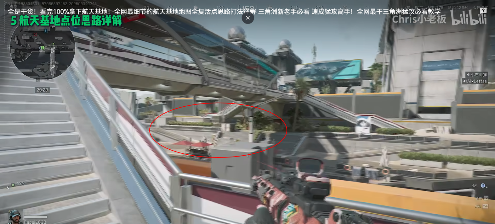

#### 架槍位2
* 中控往中控橋的陽台

    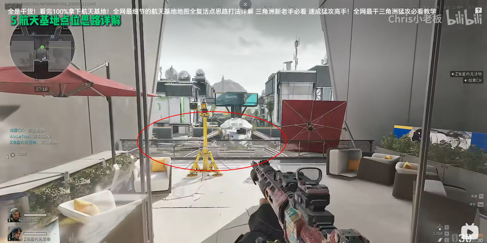

* 打拉繩過點/二員橋下過點

    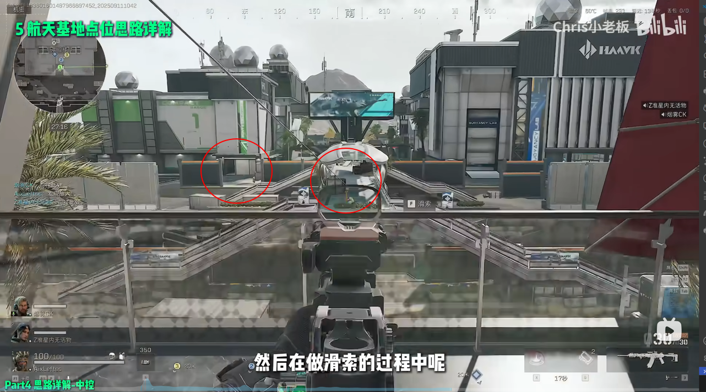

#### 架槍位3
* 中控正門看二員重生點位

### 二員
* 如果不開卡，`中控打二員就是優勢`。

#### 打法1
* 從中控橋過點`(較少)`

#### 打法2
* 打中控的話，建議打`沙地上去`，走正門很容易高打低

### 通道
* `前三~四分鐘不要在[通道]打架`，很容易被勸，頂多抽一下就要走

### 發射區
* 可去`離心(70s) & 黑室(60s)`，有帶針劑可以更快
    * 發射區不建議去黑室，因為`二員必有隊伍`刷卡一定是去藍黑室(40s)，但是`想打架算是例外`

### 小節
* 
* `宿舍<-->西大`閃擊核心點位

    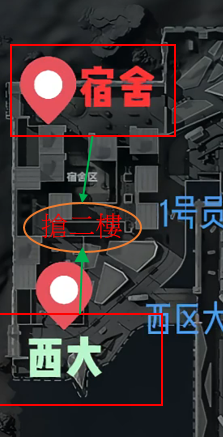

### 參考資料
-  [西大闪击宿舍焚决小学习第一期 by 诗歌柠檬茶](https://www.bilibili.com/video/BV1GavfBuEwd?vd_source=3e6241ea6065bcf4f9a52bba4006255b&spm_id_from=333.788.player.player_end_recommend&trackid=web_related_0.router-related-2479604-5tzfh.1777340583319.792)
- [5分钟告诉你航天公式打法 by 言和OwO](https://www.bilibili.com/video/BV1ZV24BHE7E/?vd_source=3e6241ea6065bcf4f9a52bba4006255b)
- [全是干货！看完100%拿下航天基地！全网最细节的航天基地地图全复活点思路打法详解 三角洲新老手必看 速成猛攻高手！全网最干三角洲猛攻必看教学 by Chris小老板](https://www.bilibili.com/video/BV1ucW3zREhc/?spm_id_from=333.337.search-card.all.click&vd_source=3e6241ea6065bcf4f9a52bba4006255b)
- ['[纯干货]' 打架老被劝？对局没思路? 三角洲最适合新手的信息处理教学！ by 千式子KokO](https://www.bilibili.com/video/BV17vdgBvESQ/?spm_id_from=333.1007.top_right_bar_window_dynamic.content.click&vd_source=3e6241ea6065bcf4f9a52bba4006255b)

## 💡 實戰心得
### 實況主心得

### 個人心得
- N/A

---
## 🔗 相關連結
- [⬅️ 返回三角洲首頁](../delta-force.md)

