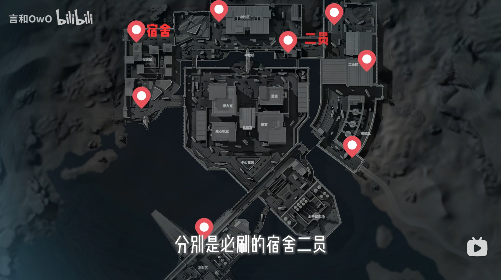
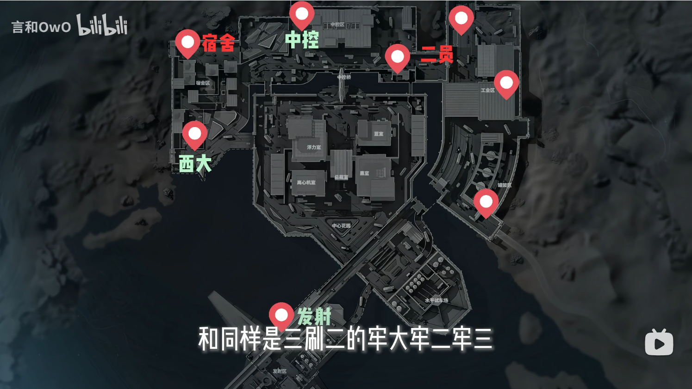
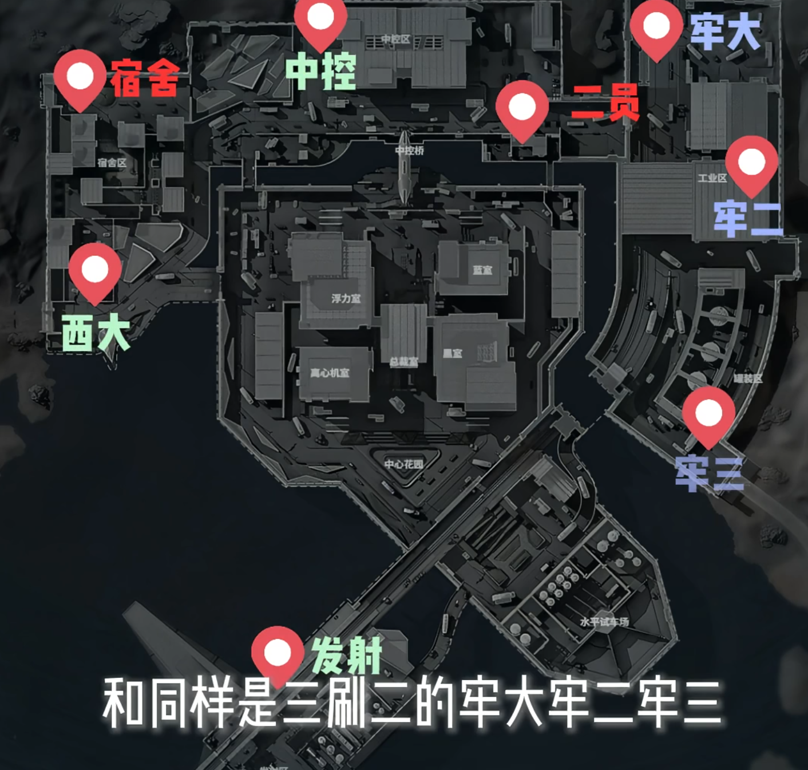
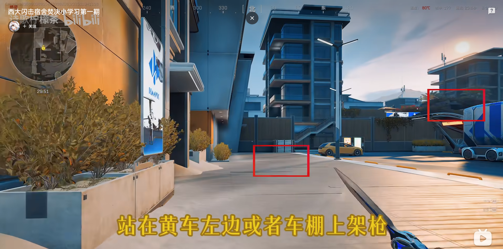
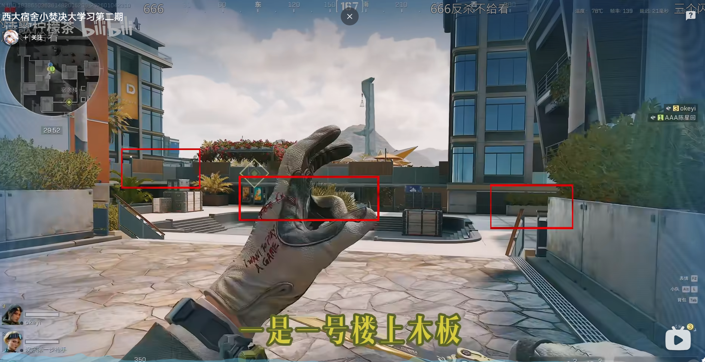

# 航天基地-`打航天不管幾號位，都要戴狙擊槍`

## 基礎觀念(通常六隊，總計18人)
* `若有殘編隊會額外多刷一隊，人數大約16~18人`
* 宿舍 & 二員必刷
    
* 三刷二: 中控、西大、發射
    
* 三刷二: 牢大、牢二、牢三
    

## 中控
* 建議打`沙地上去`，走正門很容易高打低
## 通道
* `前三~四分鐘不要在[通道]打架`，很容易被勸，頂多抽一下就要走

## 西大 & 宿舍

西大 &rightleftharpoons; 宿舍：誰先搶到 二樓木板 位置就是優勢

* [西大闪击宿舍焚决小学习第一期-by 诗歌柠檬茶](https://www.bilibili.com/video/BV1GavfBuEwd?vd_source=3e6241ea6065bcf4f9a52bba4006255b&spm_id_from=333.788.player.player_end_recommend&trackid=web_related_0.router-related-2479604-5tzfh.1777340583319.792)
    
* [西大宿舍小焚决大学习第二期-by 诗歌柠檬茶](https://www.bilibili.com/video/BV11WrkBwERH/?vd_source=3e6241ea6065bcf4f9a52bba4006255b)
    

### 參考資料
- [5分钟告诉你航天公式打法](https://www.bilibili.com/video/BV1ZV24BHE7E/?vd_source=3e6241ea6065bcf4f9a52bba4006255b)

## 💡 實戰心得
### 實況主心得

### 個人心得
- N/A

---
## 🔗 相關連結
- [⬅️ 返回三角洲首頁](../delta-force.md)

