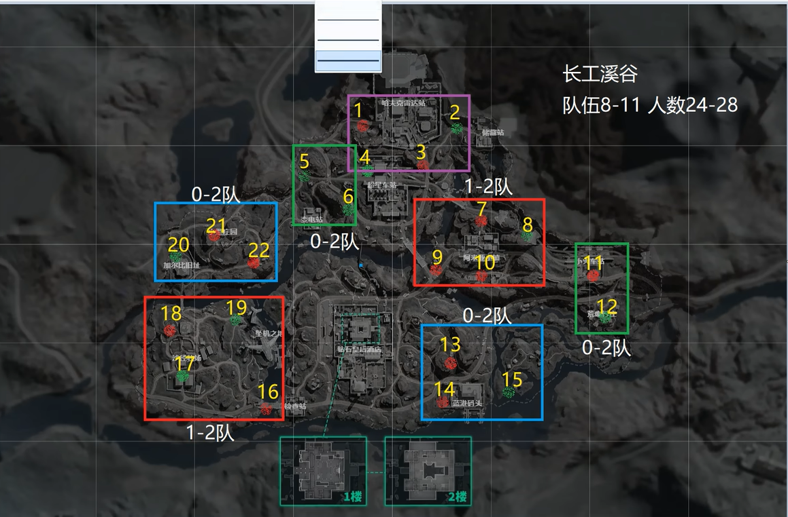
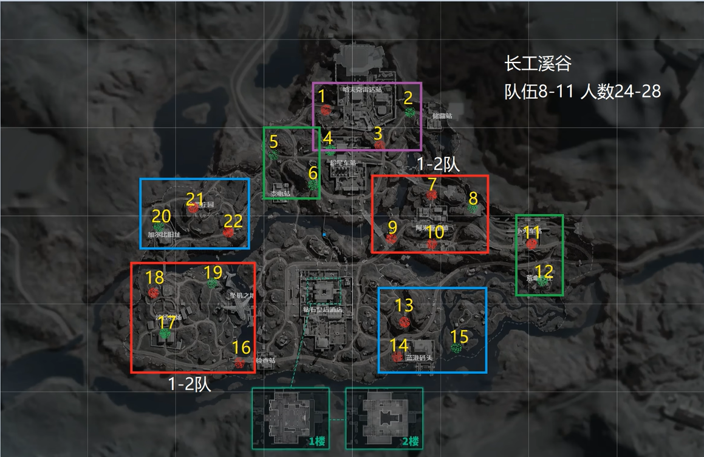
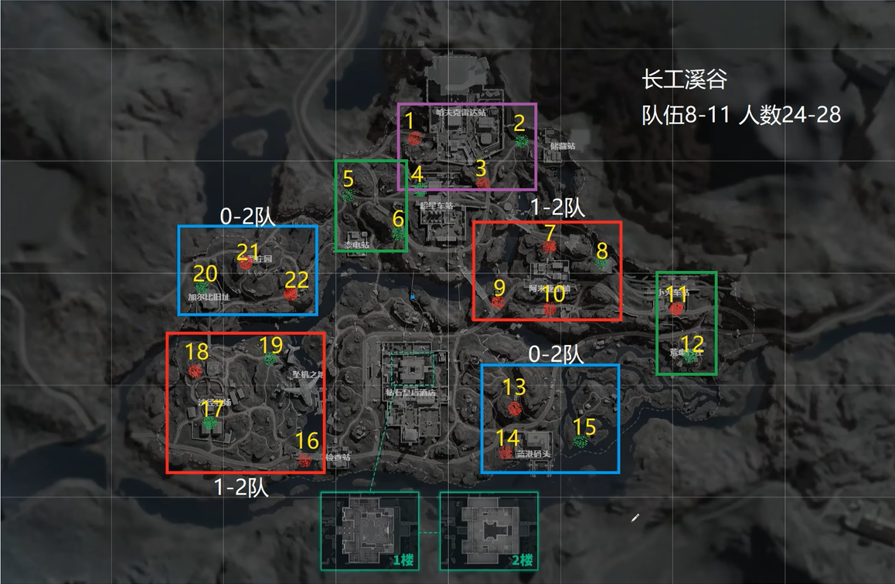
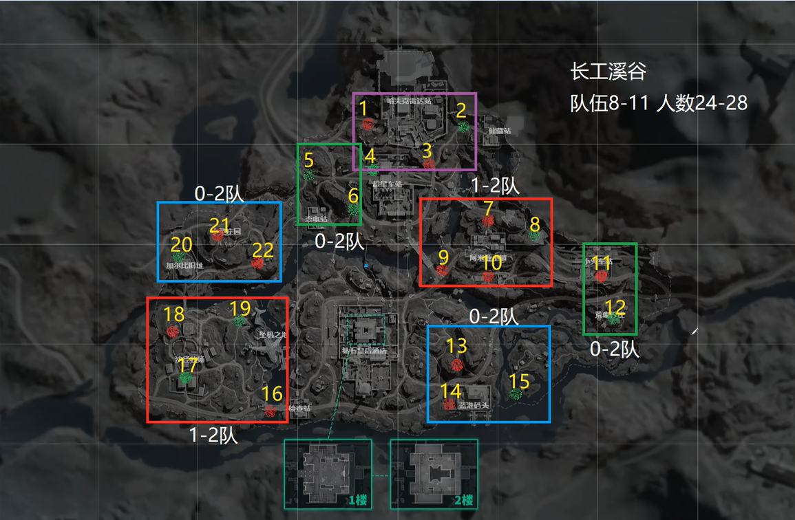

# 長弓溪谷

## 基礎觀念(通常8~11隊，總計24-28人，5種撤離方式)
* 雷達站
    * ` 1 & 4 互斥 ` 
    * ` 2 & 3 互斥 ` 
    * ` 兩邊互不影響 ` 
    
            

* 小鎮 & 墜機 VS 阿米亞小鎮
    * ` 最多2隊，最少1隊 ` 

            
            
    
* 莊園 VS 藍港碼頭
    * ` 最多2隊，最少0隊 ` 

            

* 變電站 VS 車站 & 
    * ` 最多2隊，最少0隊 `

            

### 參考資料
-  [5千局长工老油条教你出生点规律及队伍人数- 鱼也是有脾气的](https://www.bilibili.com/video/BV14gVs6SEFe/?spm_id_from=333.1387.list.card_archive.click&vd_source=3e6241ea6065bcf4f9a52bba4006255b)

## 💡 實戰心得
### 實況主心得

### 個人心得
- 要跑很遠，核心區要小心一堆鬼

---
## 🔗 相關連結
- [⬅️ 返回三角洲首頁](../delta-force.md)

